# Write-up:  Pickle Rick - Try Hack Me

This is my first write-up challenge and I am going to complet the *Pickel Rick* from from Try Hack Me!  

Lab-Link    : https://tryhackme.com/room/picklerick .

Room type   : Free

Difficulty  : Easy


## Lab description

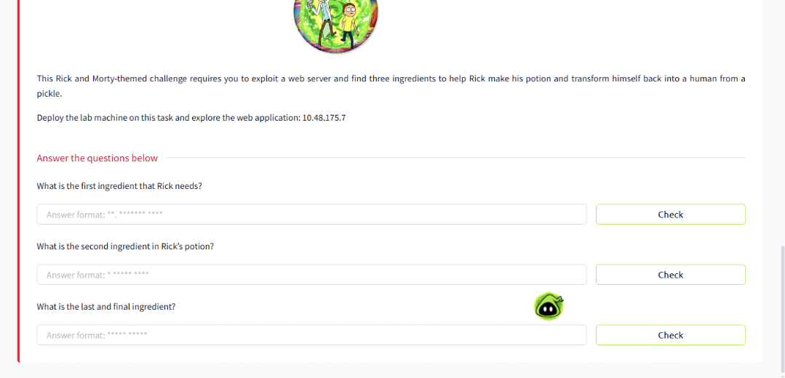

## Steps by Steps

First and more obvious thing, let’s do a enumeration with the IP we received from TryHackMe using NMAP. The target VM’s IP address, in my case, was
 10.48.175.7 .

 ## Disclaimer -  My IP address will be different from yours!
 
``` nmap -sC -sV -A 10.48.175.7 ```

The options I use are the followings:

| Option | Meaniing | Reasoning|
| -- | -- | -- |
| -sC | Use default set of scripts | Note: This includes some intrusive scans, on a CTF box this is fine, in a real-world scenario using `--script=safe` is preferred |
| -sV | Version detection | Attempt to enumerate the versions for services found |
| -A | Aggresive scan | Enables several advanced detection features at once to gather more detailed information about the target |


Without any argument specifying the ports, nmap scans the 1000 most common ports. If you want to find out more, look at the file `/usr/share/nmap/nmap-services`. 

The results come back showing just two ports open:

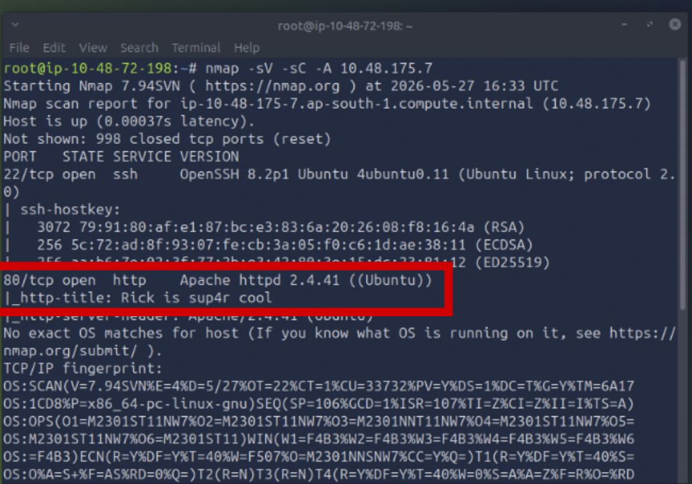

- SSH on port 22.
  Port 22 is running a SSH service with OpenSSH 8.2p1, so we might need to exploit SSH to gain access to the machine;
  
- A webserver on port 80.
  Port 80 is running a HTTP service with Apache 2.4.41, so we might need to exploit a web application to gather information or even get a web or upload a file to get a reverse shell;
And we find an interesting http-title: "Rick is sup4r cool" .

## Exploring the website

if we navigate `http://10.48.175.7` in the browser, it also seems that Rick really does need our help.

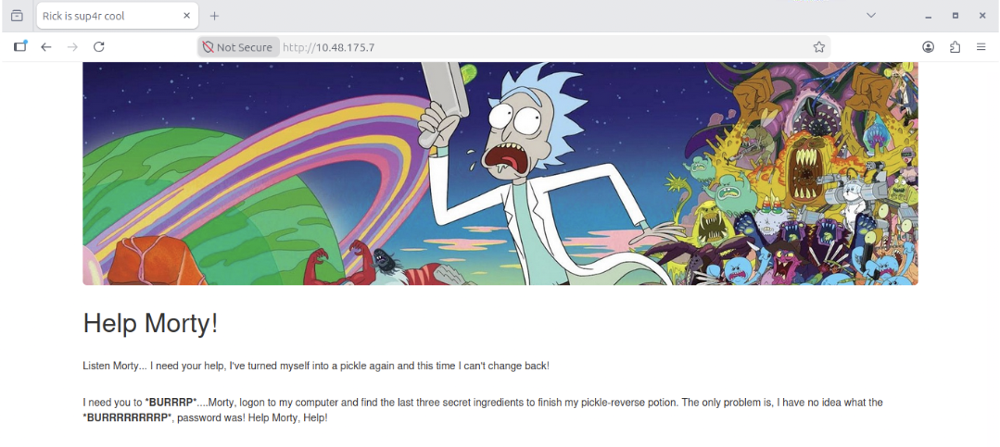

As this page doesn’t have any buttons or anything that could make us go to another page. So we have to check the page source by right clicking anywhere on the page and choosing “View page source” to see if there is something interesting.
It appears to be a fairly static page without any further link or functionality.

However, looking at the HTML reveals a piece of interesting information: a username

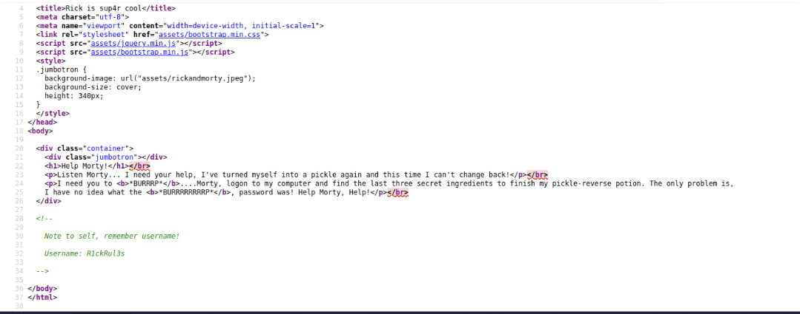

## Finding hidden directories

We are going to be using gobuster to try and locate any directories that may have been hidden from us.  
Command: `gobuster -u http://10.10.82.95 -w /usr/share/dirbuster/wordlists/directory-list-2.3-medium.txt -x txt,js,py,html,css,php` .

Command Breakdown:

    -dir: this option tells GoBuster we will brute-force for directories or files;
    
    -u (URL or Domain): the URL or Domain of the target we want to perform the brute-force;

	-w (Wordlist): as the name suggests, the wordlist we will be using to brute-force. In this situation, we are using the “directory-list-2.3-medium.txt”.

    -x (File eXtensions): the file extensions we are looking for with the provided wordlist. We are looking for the most common ones, but we could provide way more extensions to GoBuster to find hidden files;

This process will take a massive amount of time, as there are 1527925 words to be brute-forced. So we need a little patience here.

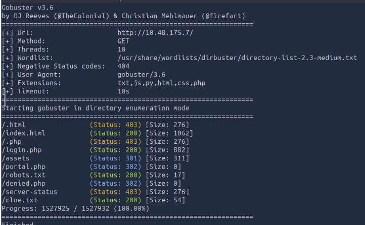

Our Gobuster found many interesting files. First I checked the "login.php" (200 HTTP Status Code) webpage, we are greeted with this login form.

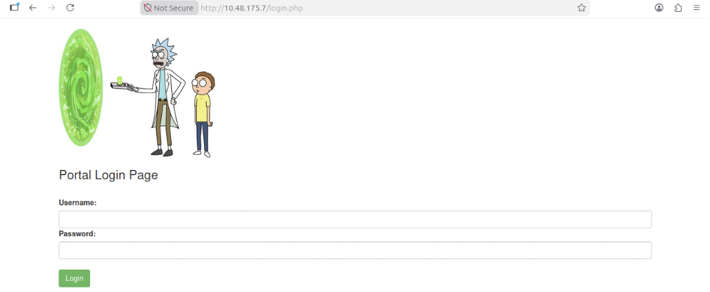

We already have a username, but no passwords. So, let’s just try to see if the other files one by one to check can we find  any insights about a password.

Finally, at the “robots.txt”, we get a very curious string. This string is actually a very common quote from Rick. Maybe this is his password? Worth trying!

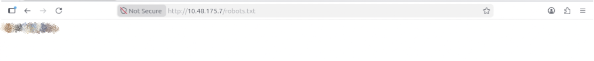

Going back to the “login.php” webpage and using “R1ckRul3s” as the username, and the string we found as the password, we are able to make a successful login, making us able to have access to the “portal.php” webpage!

## Using the website’s Command Panel

Now on this “portal.php” webpage we can see something that is gonna be extremely useful to us: a command panel. If you do a little bit of testing, you will see that this command panel basically accepts Linux commands, so it’s just like a web shell!

## First ingredient(1st flag)

We can try with command : `ls` to see the what files that are located in the current folder we’re in: 

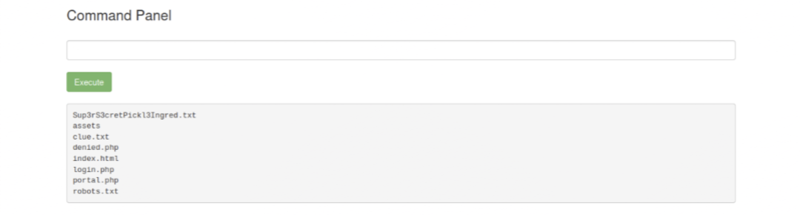

There’s a file clearly popping off there called “Sup3rS3cretPickl3Ingred.txt”, let’s read what’s inside of it.
So we can use `cat` command to read the .txt file . Oh no! this command is not working.

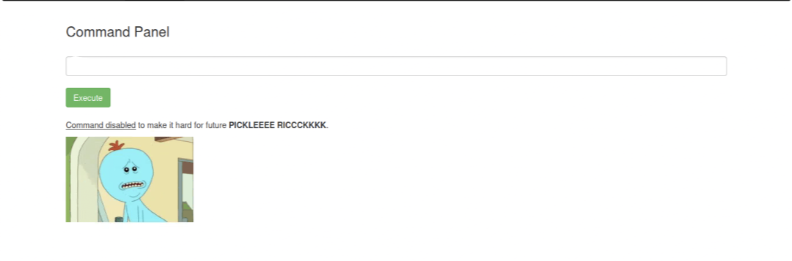

So... how do we our file? But don't worry we can use other commands like: `less` `tac` `grep` ... . By using the `less` command we found our first ingredient.

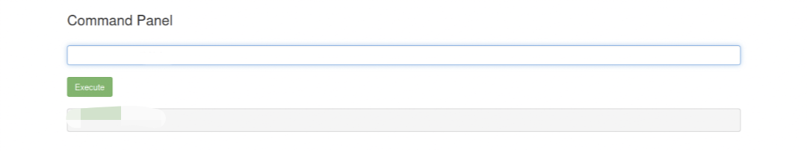

## Second ingredient(2nd flag)

Now, if we go back, we can see that there is another .txt file popping out in the `ls` command output. We can also read that file and showing this result:

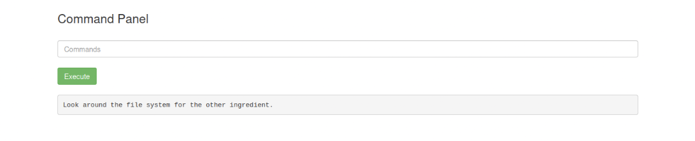

So we need to know our current location to explore other file system. Let's use command: `pwd` to see our current path. 

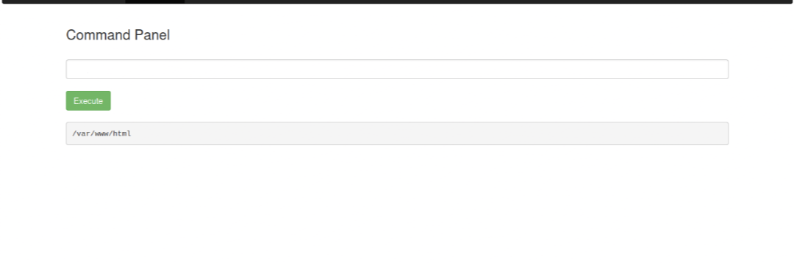

We can found other locations by using `ls \` command and here we get:

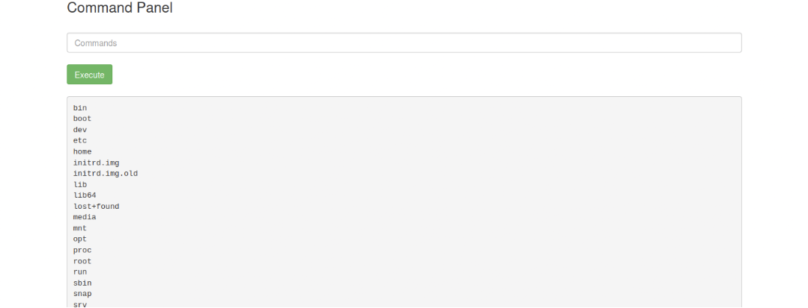

Let's keep exploring in home directory with `ls \home\` and we find "rick" and "ubuntu' .we found a home directory from “rick”! By listing the contents inside this directory with `ls \home\rick, we can actually found another file with a very flashy name of “second ingredients”:

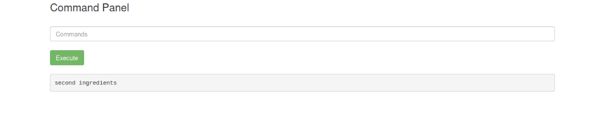

And so, by reading the contents of this file with `less /home/rick/"second ingredients”` we get the 2nd ingredient Rick needs! Note that we need to add " " befoe and after the secod ingredient.

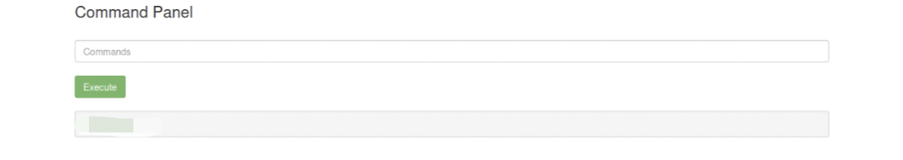

## Third ingredient(3rd flag)

As for the last ingredient, it will be under the root directory. We need to get root permission to access the root directory. So let's check the permission we have with `sudo -l`

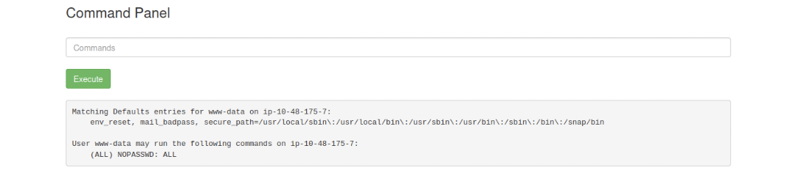

We find an useful information that we can type `sudo` command without typing any passwords(no paswords are needed). So let's try with command `sudo ls/root/`, and we find our necessary 3rd.txt file.

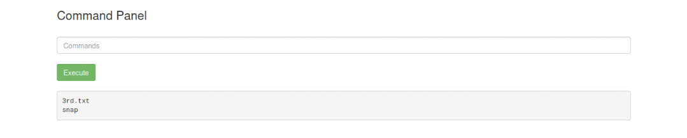

So by reading the content of this file with `sudo less/root/3rd.txt` we finally get our third ingredient and complete our Challenge.

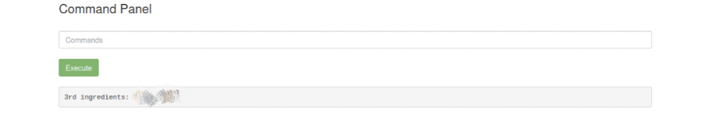


# Congratulations We have completed the Pickel Rick challenge!
