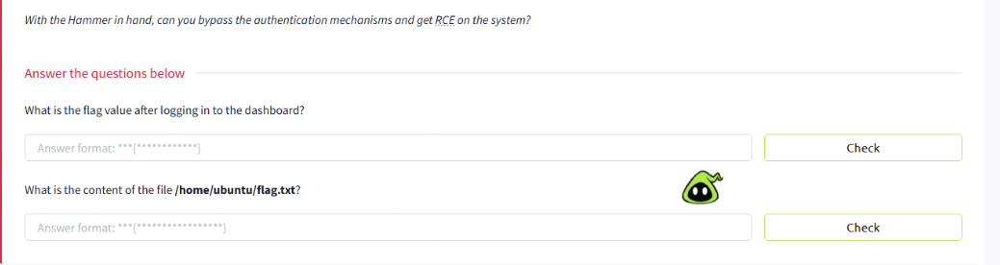
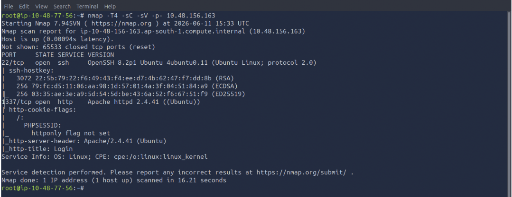
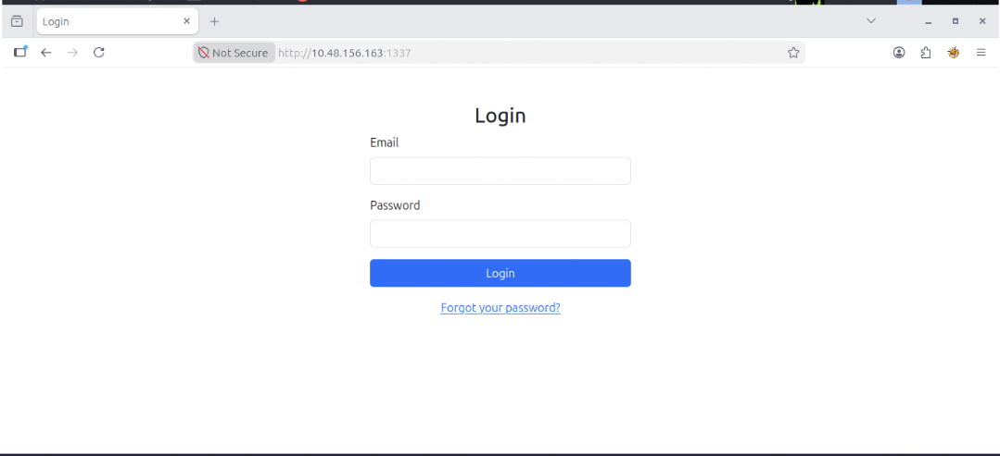
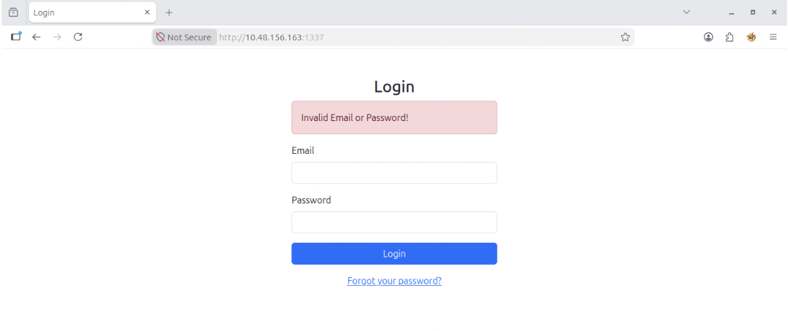
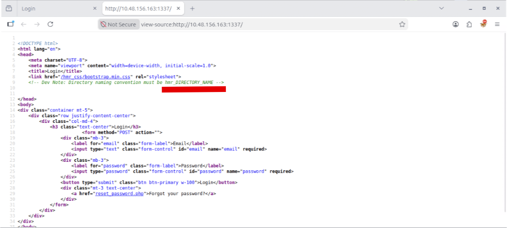
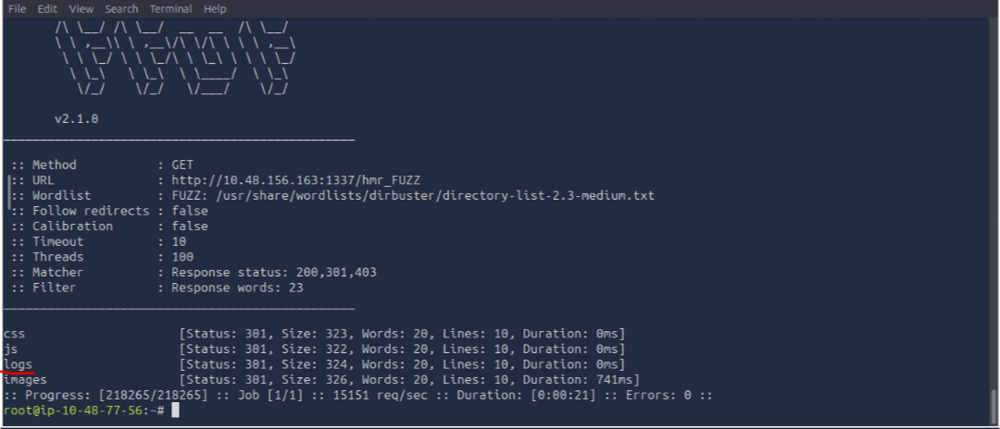
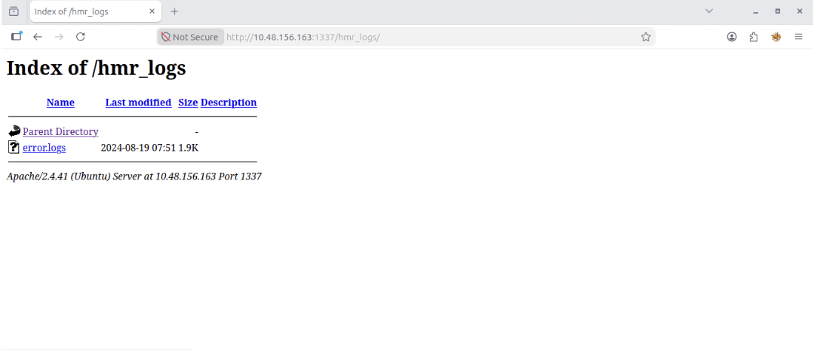
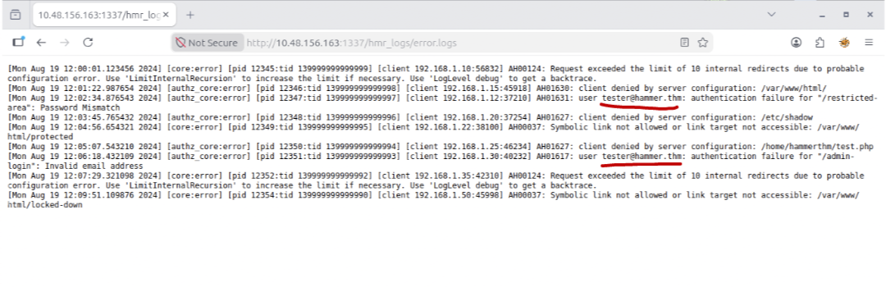
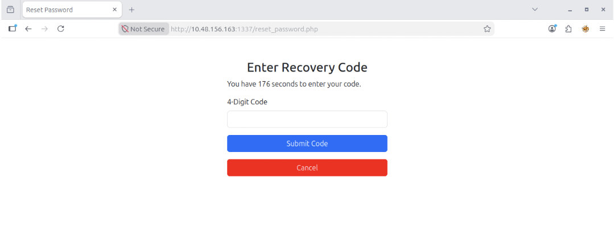

# Write-up:  Hammer - Try Hack Me

This is my walkthrough challenge of completing the *Hammer* from from Try Hack Me!  

Lab-Link    : https://tryhackme.com/room/hammer .

Room type   : Premium

Difficulty  : Medium


## Lab description



## Steps by Steps

First and more obvious thing, let’s do the IP address Enumeration which we received from TryHackMe using NMAP. The target VM’s IP address, in my case, was
 10.48.156.163 .

 ## Disclaimer -  My IP address will be different from yours!
 
``` nmap -T4 -sC -sV -p- 10.48.156.163 ```

The options I use are the followings:

| Option | Meaning | Reasoning|
| -- | -- | -- |
| -T4 | Aggressive Timing Template | Chosen to speed up the scan while still providing accurate results, reducing the overall enumeration time. |
| -sC | Default NSE Scripts |  Runs a collection of default NSE scripts to obtain useful information about discovered services and configurations. |
| -sV | Service Version Detection | Identifies service versions running on open ports, which is useful for researching potential exploits and vulnerabilities. |
| -p- |  Scan All Ports | Ensures that every TCP port is checked, helping to discover non-standard or uncommon services that may otherwise be overlooked. |

With the scan complete, the discovered services were examined further to identify potential attack vectors and gather additional information about the target.

The results come back showing just two ports open:



- SSH on port 22
  Port 22 is running an SSH service powered by OpenSSH 8.2p1 on Ubuntu. Since SSH provides remote access to the system, it may become a potential entry point if valid credentials or a vulnerability can be identified during the assessment.

- Web Server on port 1337
  Port 1337 is hosting an HTTP service running Apache 2.4.41 on Ubuntu. The Nmap results also reveal a login page, making the web application an interesting target for further enumeration. Additional testing may uncover hidden directories, authentication weaknesses, or functionality that could lead to initial access.

## Exploring the website

if we navigate `http://10.48.156.163:1337` in the browser, we find a login page with Email, password, and Forgot password options link.



I try a random email and password to check the condition. But that doesn't work.



As this page doesn’t have any buttons or anything that could make us go to another page. So we have to check the page source by right clicking anywhere on the page and choosing “View page source” to see if there is something interesting.
It appears to be a fairly static page without any further link or functionality.

However, looking at the HTML reveals a piece of interesting information:



##Directory Enumeration

Next, we used ffuf to enumerate hidden directories and files on the web application. This helps identify potentially interesting endpoints that are not linked from the main application and may reveal additional functionality or sensitive information.

Command: `ffuf -u 'http://10.48.156.163:1337/hmr_FUZZ' -w /usr/share/wordlists/dirbuster/directory-list-2.3-medium.txt -t 100 -mc 200,301,403 -fw 23` .

Command Breakdown :

    - -u (URL): Specifies the target URL where the wordlist entries will be substituted in place of the "FUZZ" keyword during the scan.

    - FUZZ: A placeholder used by ffuf. Each entry from the wordlist is inserted into this position to discover hidden directories or endpoints.

    - -w (Wordlist): Defines the wordlist used for fuzzing. In this case, "directory-list-2.3-medium.txt" is used to search for common directory names.

    - -t 100 (Threads): Sets the number of concurrent threads to 100, allowing ffuf to perform requests faster and complete the scan more efficiently.

    - -mc 200,301,403 (Match Codes): Displays only responses with HTTP status codes 200 (OK), 301 (Moved Permanently), and 403 (Forbidden), helping to identify potentially interesting resources.

    - -fw 23 (Filter Words): Filters out responses containing 23 words, reducing false positives and making the results easier to analyze.

The scan returned several valid responses, indicating the presence of accessible directories that could be investigated further during the enumeration phase.



Among the discovered endpoints, the "logs" directory appeared particularly interesting as log files may expose valuable information about the application and its users. So let's figure out.



The discovered "/hmr_logs" directory exposed an open directory listing, allowing direct access to the "error.logs" file. Log files frequently contain valuable information about the application's internal workings, making this file an attractive target for further analysis.

Upon reviewing the "error.logs" file, several authentication failure messages were identified. These entries revealed the username `tester@hammer.thm`, which appeared to be a valid account on the application. This information could prove useful during the authentication testing phase.



We can now try to enter the email in the "Forgot Password" field. After clicking the "Submit" button, it asks for OTP verification. And reveling that we only have 180 seconds to enter the OTP.



