# Write-up:  Hammer - Try Hack Me

This is my walkthrough challenge of completing the *Hammer* from from Try Hack Me!  

Lab-Link    : https://tryhackme.com/room/hammer .

Room type   : Premium

Difficulty  : Medium


## Lab description


## Steps by Steps

First and more obvious thing, let’s do the IP address Enumeration which we received from TryHackMe using NMAP. The target VM’s IP address, in my case, was
 10.48.156.163 .

 ## Disclaimer -  My IP address will be different from yours!
 
``` nmap -T4 -sC -sV -p- 10.48.156.163 ```

The options I use are the followings:

| Option | Meaning | Reasoning|
| -- | -- | -- |
| -T4 | Aggressive Timing Template | Chosen to speed up the scan while still providing accurate results, reducing the overall enumeration time. |
| -sC | Default NSE Scripts |  Runs a collection of default NSE scripts to obtain useful information about discovered services and configurations. |
| -sV | Service Version Detection | Identifies service versions running on open ports, which is useful for researching potential exploits and vulnerabilities. |
| -p- |  Scan All Ports | Ensures that every TCP port is checked, helping to discover non-standard or uncommon services that may otherwise be overlooked. |

With the scan complete, the discovered services were examined further to identify potential attack vectors and gather additional information about the target.

The results come back showing just two ports open:


- SSH on port 22
  Port 22 is running an SSH service powered by OpenSSH 8.2p1 on Ubuntu. Since SSH provides remote access to the system, it may become a potential entry point if valid credentials or a vulnerability can be identified during the assessment.

- Web Server on port 1337
  Port 1337 is hosting an HTTP service running Apache 2.4.41 on Ubuntu. The Nmap results also reveal a login page, making the web application an interesting target for further enumeration. Additional testing may uncover hidden directories, authentication weaknesses, or functionality that could lead to initial access.

## Exploring the website

if we navigate `http://10.48.156.163:1337` in the browser, we find a login page with Email, password, and Forgot password options link.


I try a random email and password to check the condition. But that doesn't work.


As this page doesn’t have any buttons or anything that could make us go to another page. So we have to check the page source by right clicking anywhere on the page and choosing “View page source” to see if there is something interesting.
It appears to be a fairly static page without any further link or functionality.

However, looking at the HTML reveals a piece of interesting information:


##Directory Enumeration

Next, we used ffuf to enumerate hidden directories and files on the web application. This helps identify potentially interesting endpoints that are not linked from the main application and may reveal additional functionality or sensitive information.

Command: `ffuf -u 'http://10.48.156.163:1337/hmr_FUZZ' -w /usr/share/wordlists/dirbuster/directory-list-2.3-medium.txt -t 100 -mc 200,301,403 -fw 23` .

Command Breakdown :

    - -u (URL): Specifies the target URL where the wordlist entries will be substituted in place of the "FUZZ" keyword during the scan.

    - FUZZ: A placeholder used by ffuf. Each entry from the wordlist is inserted into this position to discover hidden directories or endpoints.

    - -w (Wordlist): Defines the wordlist used for fuzzing. In this case, "directory-list-2.3-medium.txt" is used to search for common directory names.

    - -t 100 (Threads): Sets the number of concurrent threads to 100, allowing ffuf to perform requests faster and complete the scan more efficiently.

    - -mc 200,301,403 (Match Codes): Displays only responses with HTTP status codes 200 (OK), 301 (Moved Permanently), and 403 (Forbidden), helping to identify potentially interesting resources.

    - -fw 23 (Filter Words): Filters out responses containing 23 words, reducing false positives and making the results easier to analyze.

The scan returned several valid responses, indicating the presence of accessible directories that could be investigated further during the enumeration phase.


Among the discovered endpoints, the "logs" directory appeared particularly interesting as log files may expose valuable information about the application and its users. So let's figure out.


The discovered "/hmr_logs" directory exposed an open directory listing, allowing direct access to the "error.logs" file. Log files frequently contain valuable information about the application's internal workings, making this file an attractive target for further analysis.

Upon reviewing the "error.logs" file, several authentication failure messages were identified. These entries revealed the username `tester@hammer.thm`, which appeared to be a valid account on the application. This information could prove useful during the authentication testing phase.


## Authentication Testing

Using the previously discovered username , a password reset request was initiated through the application's "Forgot your Password" feature. After submitting the username, the application redirected to an OTP verification page, where a four-digit OTP was required to continue the password reset process.

During this stage, it was observed that the OTP was valid for only 180 seconds, indicating a time-based restriction on the verification process.
We can now try to enter the email in the "Forgot Password" field. After clicking the "Submit" button, it asks for OTP verification. And reveling that we only have 180 seconds to enter the OTP.
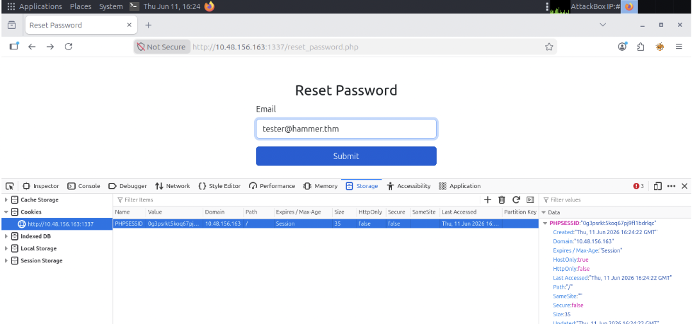

## Bypassing the Rate Limit

Since it is only four digit,we should be able to brute-force it easily.However if we attempt to do so, we will first notice the `Rate-Limit-Pending` header in the response, indicating we have 4 remaining attempts.

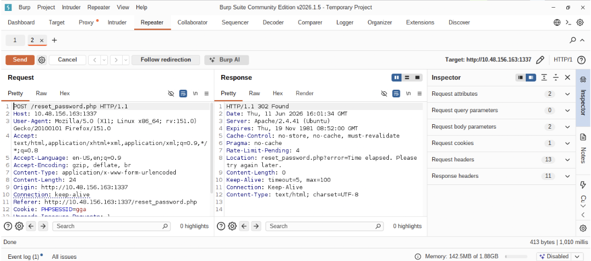

If the limit is exceeded, the page displays a "rate limit exceeded" message.
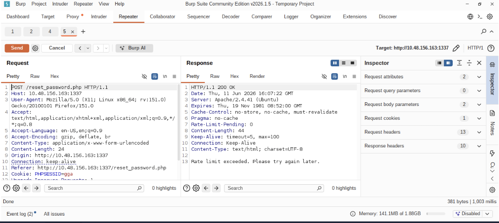

Trying out different common methods for it, we have success using the X-Forwarded-For header.If we add the `X-Forwarded-For: 127.0.0.1` header, we can see the rate limit counter being reset. Of course, once this counter also reaches zero, we will be once again rate-limited.  But simply changing the IP address in the header, we are able to reset the counter once more.

## Brute-Forcing and Reseting the Password for First Flag

At this point, I got stuck for a long time. I wasn’t able to brute-force the OTP using ffuf or Burp Suite. So, I Googled the issue and found a script for brute-forcing OTPs. I’ll provide a link to the script in the reference section below.

[Passwrod_Resetb Code](Script.py)

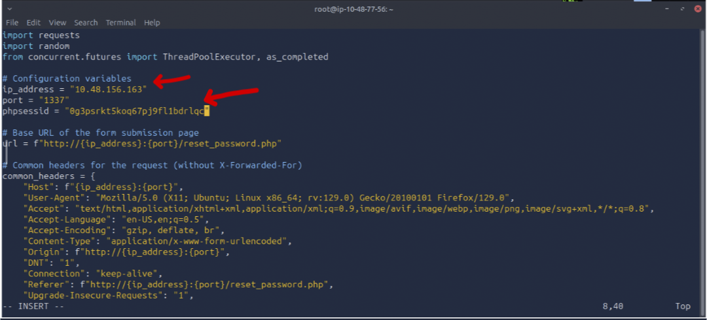

After enetring the IP address and phpsesid vales, the tool started brute-forcing.

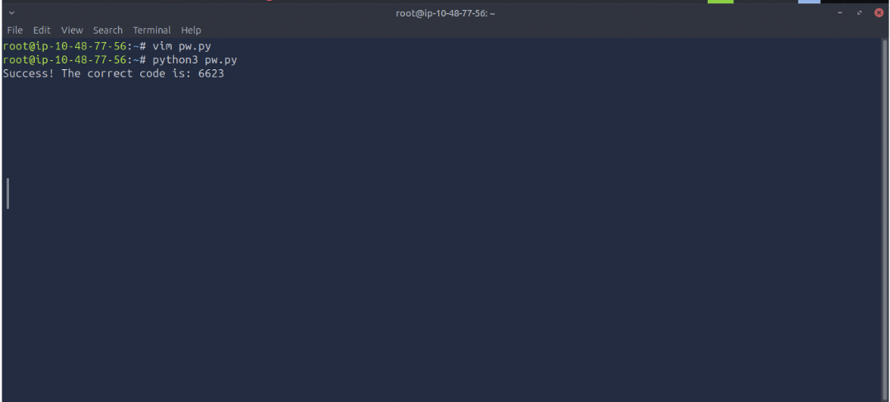

As we can see, the tool successfully found the OTP. After entering the OTP value on the verification page, it will ask you to set a new password.

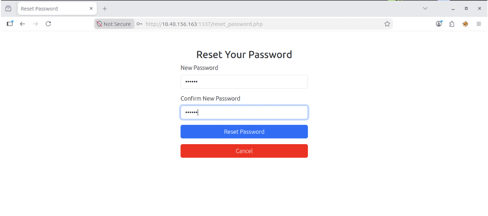

So we can login by typing the new passwod and an email address we found earlier.

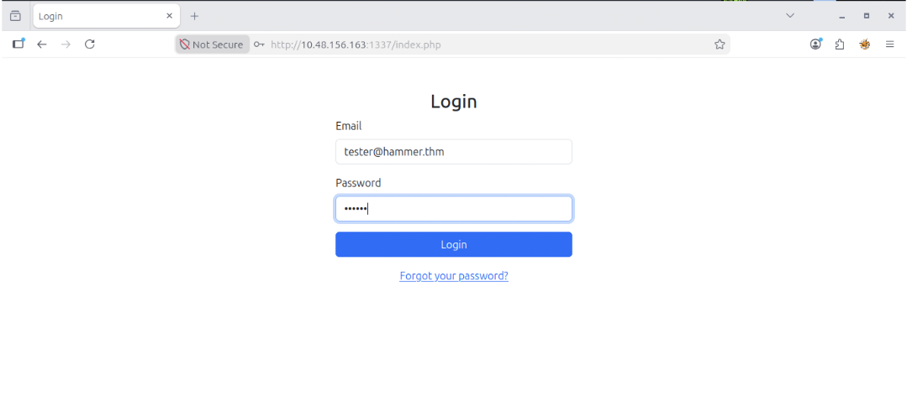

Using these new credentials to login at `http://10.48.156.163:1337/index.php`, we get redirected to `http://10.48.156.163:1337/dashboard.php` where we get our first flag.

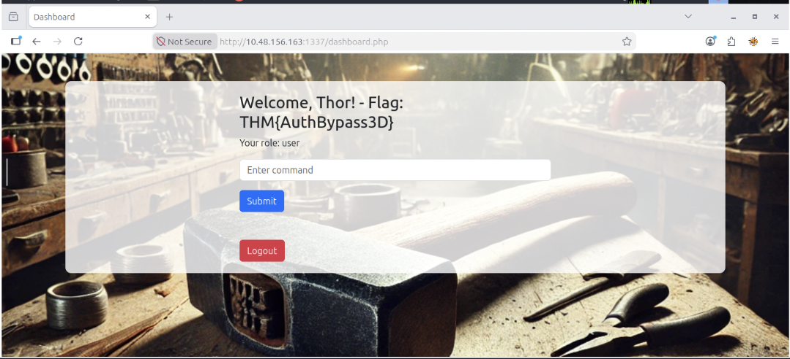

## Second Flag

There is a search box in the application, and when we try the "ls" command, it displays multiple files.

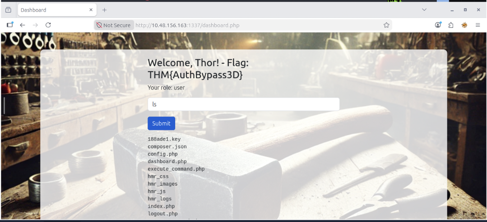

Let's try other coomands to check if they are worked or not.But unfornatulately the error is showed.


While reviewing the page source, a JWT (JSON Web Token) value was discovered. Since JWTs are commonly used to store authentication and session-related information, this finding warranted further investigation. The token could potentially reveal useful claims, user information, or security weaknesses depending on how it was implemented by the application.

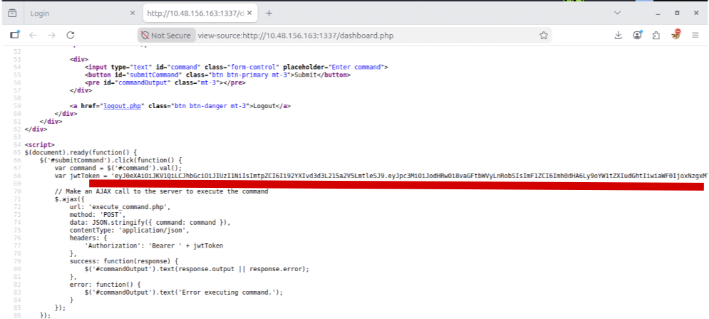

After decoding the JWT token with jwt.io, the payload revealed a key file path `/var/www/mykey.key` and a "role" claim. Both findings appeared significant, as they could provide insight into how authentication and authorization were implemented within the application.

Having previously identified a ".key" file, I attempted to access it directly via the web server. The file was successfully downloaded, and inspection of its contents revealed the JWT signing key referenced in the token payload. This provided valuable insight into how the application handled JWT authentication.

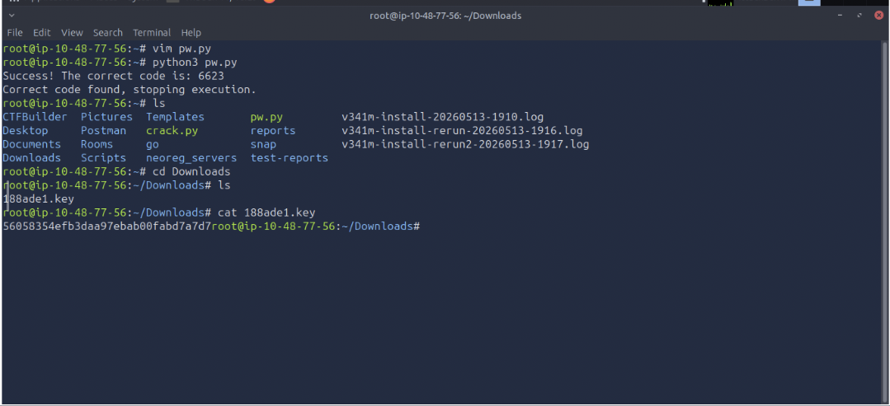

Using the information gathered during enumeration, the JWT was modified and re-signed. The "kid" header value (1) was updated to point to the discovered key file, while the "role" claim (2) was changed to "admin". Finally, the recovered signing key (3) was supplied to generate a valid signature. The modified token was then encoded, producing a new JWT with elevated privileges.

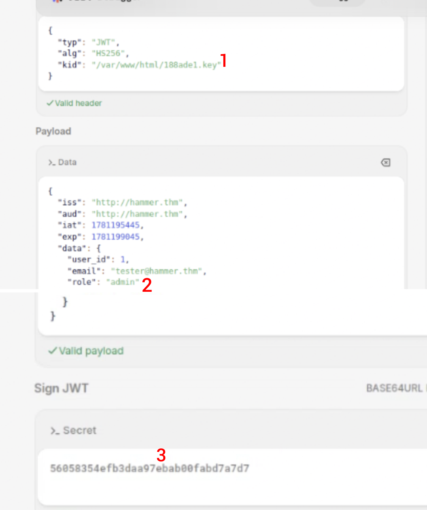

The request was intercepted using Burp Suite and forwarded to Repeater. The original JWT was replaced with the newly generated token, and the modified request was resent to verify whether the application trusted the updated token.

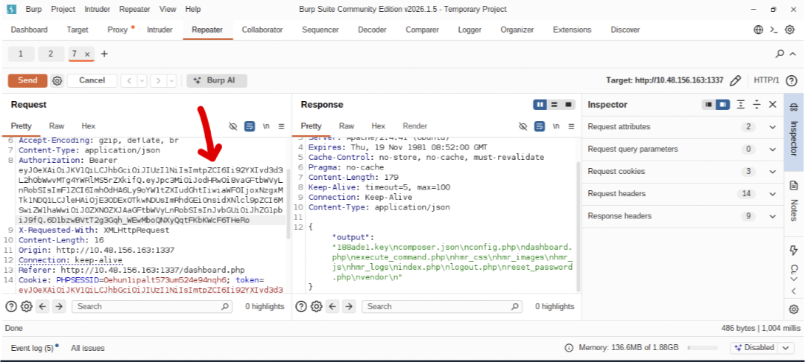

As an initial test, the `pwd` command was executed to confirm command execution. The server returned the current working directory, indicating that the payload was functioning correctly.

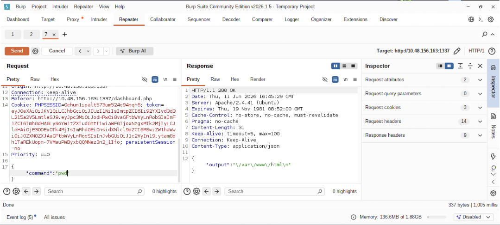

With command execution confirmed, the target file was accessed using the path referenced by the challenge. Inspection of the file contents revealed the second flag, demonstrating successful access to the intended resource.

## Conclusion

With both flags successfully obtained, the challenge was completed. This room demonstrated the importance of thorough enumeration and showed how seemingly minor disclosures can be leveraged to achieve higher levels of access.

Thanks for reading, and I hope you found this walkthrough useful.

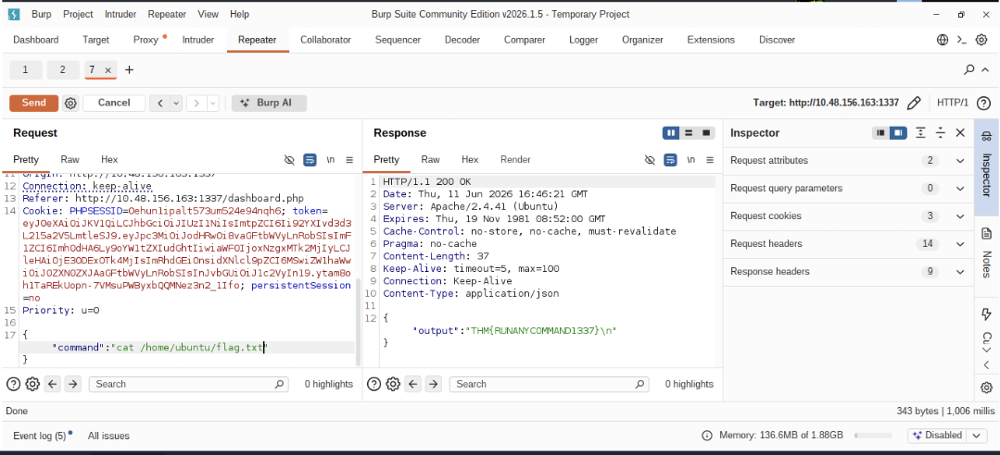
